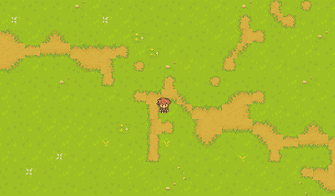

# RPG Game with Ebiten

## Description

This is a basic RPG game built with [Ebiten](https://ebitengine.org/), a 2D game engine for Go. The game is still in its early stages. 

## Controls

- AWSD - movement
- shift - dashing
- mousewheel - zooming

## Logs

### Version History

#### 2024.10.19 - Version 0.0.1
- Initial setup of the game loop (no game logic implemented yet).
- Added button UI functions and basic game variables, such as `gamestate`.

#### 2024.10.20 - Version 0.0.2
- Moved `screenWidth` and `screenHeight` out of `gamestate`.
- Added a basic test map.

#### 2024.10.21 - Version 0.0.3
- Implemented a function for map creation.
- Added support for all screen sizes.
- Began improvements on map generation.

#### 2024.10.23 - Version 0.0.4
- Enhanced map creation:
  - Adjustable map size.
  - Improved randomization.

#### 2024.10.24 - Version 0.0.5
- Standardized position handling with a `pos` struct.
- Added basic character movement.
- Refactored code by splitting `main` into multiple files.

#### 2024.10.31 - Version 0.0.6
- Fixed movement

#### 2024.11.01 - version 0.0.7
- Added delta time
- Added enemies

#### 2024.11.01 - version 0.0.8
- Added sliders to util package
- Started working on adding dashing 

#### 2024.11.07 - version 0.0.9
- Added camerea tracking

#### 2024.11.13 - version 0.1.1
- Added tilemap textures
- Added animations for character 
- Started working on texture handling

#### 2024.11.13 - version 0.1.2
- Finished dashing-ui
- Fixed zooming

#### 2024.11.14 - version 0.1.3
- Added [mapmaker](https://github.com/bencewokk/mapmaker)

#### 2024.11.17 - version 0.1.4
- Implemented trees into the game and mapmaker
- Added layering for trees and the character