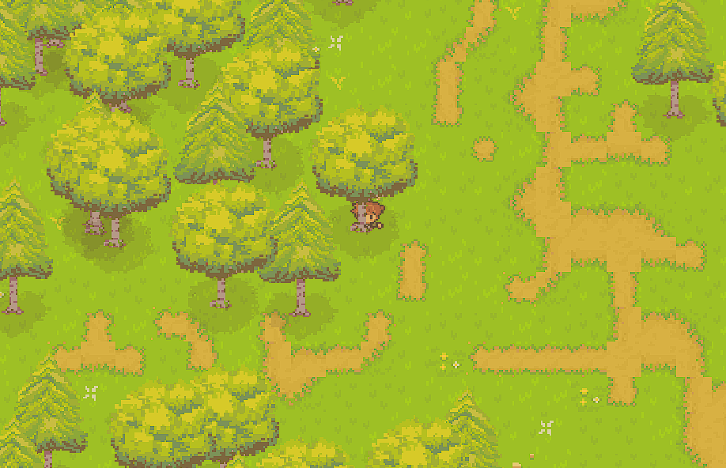

# RPG Game with Ebiten



## Description

This is a basic RPG game built with [Ebiten](https://ebitengine.org/), a 2D game engine for Go. The game is still in its early stages. 

The [sprite pack](https://ipyxeloutlookcomar.itch.io/forgottenland) I am using can be found here. 

## Controls

- WASD – Move
- Shift – Dash
- Mouse Wheel – Zoom camera
- E – Talk / interact (NPC dialogue)
- Space / Enter / Left Click – Advance dialogue when talking
- ESC – In game: pause / In menus: exit
- P – Toggle pause

## Current Features

- Tile-based world & multiple terrain textures
- Player movement, dash & animation system (`animations.json` manifest)
- Enemies with basic pathfinding
- Floating damage indicators (randomized drift, crit variation)
- NPCs with animated sprites & dialogue interaction
- UI components: buttons (improved visuals), sliders
- Main menu + options submenu
- Pause overlay (washed background tint + music volume squash)
- Looping background music across all states (volume lowered while paused)
- Integrated simple map editor (`mapeditor/`)

## Build & Run

Requires Go (1.22+ recommended).

```powershell
go run .
```

Build binary:

```powershell
go build -o rpg.exe .
```

## Assets

Sprite pack: https://ipyxeloutlookcomar.itch.io/forgottenland (check original license for attribution requirements).

## Roadmap Ideas

- Volume slider in options
- Quest / branching dialogue system
- Save / load
- Particle & combat feedback polish
- True desaturation / blur shader for pause
- Configurable keybinds
- Replace debug font with custom bitmap font

## Known Limitations

- Debug font text rendering
- No persistence (session-only)
- Basic AI behaviors
- Pause overlay is a flat tint (no shader effects yet)

## Logs

### Version History

#### 2024.10.19 - Version 0.0.1
- Initial setup of the game loop (no game logic implemented yet).
- Added button UI functions and basic game variables, such as `gamestate`.

#### 2024.10.20 - Version 0.0.2
- Moved `screenWidth` and `screenHeight` out of `gamestate`.
- Added a basic test map.

#### 2024.10.21 - Version 0.0.3
- Implemented a function for map creation.
- Added support for all screen sizes.
- Began improvements on map generation.

#### 2024.10.23 - Version 0.0.4
- Enhanced map creation:
  - Adjustable map size.
  - Improved randomization.

#### 2024.10.24 - Version 0.0.5
- Standardized position handling with a `pos` struct.
- Added basic character movement.
- Refactored code by splitting `main` into multiple files.

#### 2024.10.31 - Version 0.0.6
- Fixed movement

#### 2024.11.01 - version 0.0.7
- Added delta time
- Added enemies

#### 2024.11.01 - version 0.0.8
- Added sliders to util package
- Started working on adding dashing 

#### 2024.11.07 - version 0.0.9
- Added camerea tracking

#### 2024.11.13 - version 0.1.1
- Added tilemap textures
- Added animations for character 
- Started working on texture handling

#### 2024.11.13 - version 0.1.2
- Finished dashing-ui
- Fixed zooming

#### 2024.11.14 - version 0.1.3
- Added [mapmaker](https://github.com/bencewokk/mapmaker)

#### 2024.11.17 - version 0.1.4
- Implemented trees into the game and mapmaker
- Added layering for trees and the character

#### 2024.11.27 - version 0.1.5
- Added pathfinding for enemies
- Started working on basic gameplay and interactions between players and enemies

#### 2025.08.08 - version 0.1.6
- Implemented the mapeditor in this repo instead /bencewokk/mapmaker

#### 2025.08.09 - version 0.1.7
- Added NPC dialogue system & sprite animation
- Randomized floating damage indicators (with crit emphasis)
- Continuous background music (volume squashed on pause instead of stopping)
- Pause state with washed overlay & menu (Resume/Menu/Exit)
- Improved button visuals (gradient, border, shadow, hover highlight)
- Simplified menu background for clarity after ambient prototype
- Audio volume management refactor (always playing, state-based volume)
